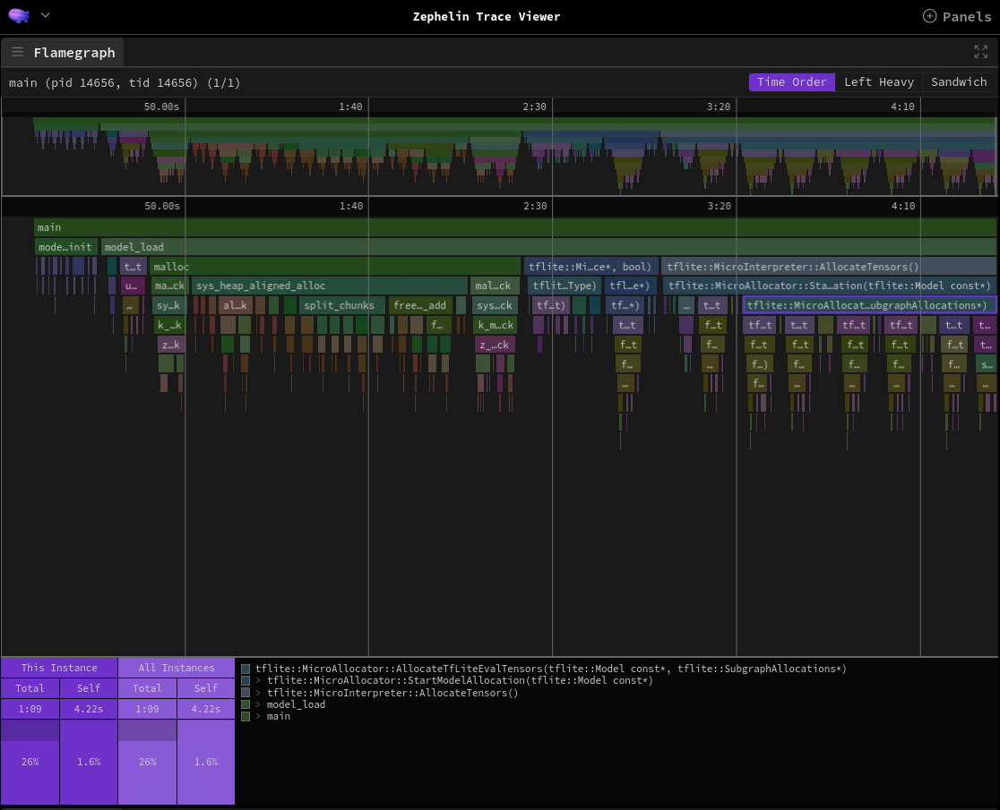

# Adding support for new AI inference libraries

This chapter describes a few ways to trace a new AI runtime:
* [Using dedicated runtime events](runtime-support) - requires additional steps, but provides the most complex information and visualization,
* [Using instrumentation subsystem](runtime-instrumentation) - can be used as is, but does not provide all the necessary information, therefore making some visualization unavailable.

(runtime-support)=
## Implementing support

A runtime support provides versatile information about a model's execution and its architecture, helping to analyze and optimize an application.
This section describes how to implement the support based on a TFLM profiling example.

### Create new events for the runtime

First and foremost, a new runtime-specific events have to be defined.
As the CTF (Common Trace Format) format requires an additional metadata file with the event structures, all definitions are placed in {zpl_repo}`zpl/metadata`.
In this file, `zpl_tflm_enter` and `zpl_tflm_exit` are defined:

```
event {
	name = zpl_tflm_enter;
	id = 0xA0;
	fields := struct {
		uint32_t thread_id;
		uint16_t subgraph_idx;
		uint16_t op_idx;
		uint16_t tag_len;
		ctf_bounded_string_t tag[tag_len];
		uint32_t arena_used_bytes;
		uint32_t arena_tail_usage;
	};
};

event {
	name = zpl_tflm_exit;
	id = 0xA1;
	fields := struct {
		uint32_t thread_id;
		uint16_t subgraph_idx;
		uint16_t op_idx;
		uint16_t tag_len;
		ctf_bounded_string_t tag[tag_len];
		uint32_t arena_used_bytes;
		uint32_t arena_tail_usage;
	};
};
```

There are several things to keep in mind when adding new events:
* Each event inherits the `id` and `timestamp` fields from the header defined in [Zephyr](https://github.com/zephyrproject-rtos/zephyr/blob/c77e5a60fdd17941ad57ec7617c00b053ba4b359/subsys/tracing/ctf/tsdl/metadata#L10-L13),
* The `id` has to be unique across the given model,
* Two events are defined to represent a beginning and an end of an operation,
* A runtime event has to have:
  * `op_idx` - ID of the operation instance in the graph,
  * `thread_id` - ID of the thread executing the operation,
  * `tag` - name of the operation (its length can be hard-coded, or dynamic based on another parameter - `tag_len` in this example).
* `subgraph_idx` is an optional field used if a model is subdivided into several subgraphs (e.g. executed on different processors),
* Other parameters of the event are not required, but will be displayed by the Trace Viewer.

The same structure has to be mirrored in the code (a full example can be found in {zpl_repo}`include/zpl/tflm_event.h`):

```c
/* TFLite Micro events IDs */
#define ZPL_TFLM_ENTER_EVENT 0xA0
#define ZPL_TFLM_EXIT_EVENT 0xA1

typedef struct __packed {
  // Event header defined by Zephyr
	uint32_t timestamp;
	uint16_t id;
	// Event fields
	uint32_t thread_id;
	uint16_t subgraph_idx;
	uint16_t op_idx;
	uint16_t tag_len;
	uint8_t tag[CONFIG_ZPL_TRACE_CTF_MAX_STR_LEN];
	uint32_t arena_used_bytes;
	uint32_t arena_tail_usage;
} zpl_tflm_event_t;
```

The struct has to define the same fields with the same types, as well as `timestamp` and `id` from the event header.
Moreover, the `__packed` attribute is required to avoid gaps between data, which would break the CTF structure.

Using this, events can be emitted with the [trace_format_raw_data](https://docs.zephyrproject.org/apidoc/latest/group__subsys__tracing__format__apis.html#gadb864c39916bc50bad341964fead14f5) function, e.g.:

```c
#include <zephyr/tracing/tracing_format.h>

zpl_tflm_event_t zpl_tflm_exit_event = {
	.timestamp = zpl_timestamp_get_from_cycles(cycles),
	.id = is_exit ? ZPL_TFLM_EXIT_EVENT : ZPL_TFLM_ENTER_EVENT,
	.thread_id = (uint32_t)k_current_get(),
	.subgraph_idx = subgraph_idx,
	.op_idx = op_idx,
	.arena_used_bytes = arena_used_bytes,
	.arena_tail_usage = arena_tail_usage,
	.tag_len = CONFIG_ZPL_TRACE_CTF_MAX_STR_LEN,
};

tracing_format_raw_data(
	(uint8_t *)&zpl_tflm_exit_event, sizeof(zpl_tflm_exit_event)
);
```

The example shows how to emit events in CTF; for human-readable format, the [TRACE_STRING](https://docs.zephyrproject.org/apidoc/latest/group__subsys__tracing__format__apis.html#gac6aa3236d7aeb8c4a3f0c421899f74e6) macro can be used:

```c
TRACING_STRING(
	"zpl_tflm_%s_event: subgraph_idx=%d op_idx=%d tag=%s "
	"arena_used_bytes=%d arena_tail_usage=%d\n",
	is_exit ? "exit" : "enter", subgraph_idx, op_idx, tag,
	arena_used_bytes, arena_tail_usage);
```

The two approaches should be combined to easily change a trace format.
It can be achieved by selecting the code with the `ifdef` directive checking the `CONFIG_ZPL_TRACE_FORMAT_CTF` or `CONFIG_ZPL_TRACE_FORMAT_PLAINTEXT` options.
An example can be found in {zpl_repo}`zpl/profilers/tflm/tflm_event.c`.

It is advised to wrap the emitting mechanism into one function for easier use.

### Emit events in the runtime

The next step is to emit the new events from the runtime.
This can differ greatly based on the runtime's architecture, but it is suggested to emit events right before and after an operation is executed, ensuring the precision of the trace.

One way to achieve that is to use a callback-based approach - implementing event emitting functions or methods that will be automatically called by the runtime.
For instance, in TFLM, such methods are available in the `MicroProfilerInterface` class (`BeginEvent` and `EndEvent`).

Optionally, instead of emitting events right away in the callback, they can be stored in the buffer and emitted after an inference is finished.
This decreases tracing overhead on the inference times.

The implementation for TFLM can be found in {zpl_repo}`zpl/profilers/tflm/tflm_profiler.cpp`.

Moreover, it is advised to emit the `zpl_inference_enter` and `zpl_inference_exit` events, respectively before and after an inference, in order to keep track of the whole model inference time.
To emit them, functions from {zpl_repo}`include/zpl/inference_event.h` can be used.

The `zpl_inference` events require information about the model ID, which is used in scenarios when more than one model is executed.
In case of TFLM, the model address is used as the ID.

:::{note}
A similar effect can be achieved with [](code_scopes), but this approach is not as extensible as the one described above, making it harder to work with.
:::

### Add custom processing for new events

In order to use new events as the ones describing model inference, they have to be converted to [](model-layer-event) TEF events.
It can be done with a custom event processing during conversion from CTF to TEF, defined in {zpl_repo}`scripts/prepare_trace`.
A custom event definition has to be returned by the `create_custom_events` function.

```python
def tflm_op_name(msg: "bt2._EventMessageConst") -> str:
    fields = msg.event.payload_field
    if not fields:
        return ""
    name = str(fields.get("tag", ""))

    # Add subgraph index at the end, if exists
    if "subgraph_idx" in fields:
        name += f"_{fields['subgraph_idx']}"

    # Add operator index at the end
    name += f"_{fields['op_idx']}"

    return name

CustomEventDefinition(
    "MODEL::",
    "zpl_tflm_enter",
    "zpl_tflm_exit",
    tflm_op_name,
    lambda _: {"runtime": "TFLite Micro"},
)
```

This example specifies that `zpl_tflm_enter` and `zpl_tflm_exit` will be converted to the {{TEF_Duration}} event - [](model-layer-event), where the suffix of the event name will created by the `tflm_op_name` function.
Moreover, custom events will be appended with an additional parameter produced by the last function, in this case `runtime="TFLite Micro"`.

The custom event name has to be unique for each operation type, therefore it is advised to use the `op_idx` field.
Furthermore, to improve the readability of trace, it should also contain a human-readable name (e.g. `tag` field).

### Implement model metadata extraction

You can provide more information about the model with [](model-event).
Based on the information provided, the plot with the operator size will be available, together with extra properties in the `Detail` view.

In case of TFLM, metadata are extracted from a model with LiteRT's `Interpreter` and FlatBuffer schema - see {zpl_repo}`scripts/extract_tflite_model_data.py`.

Furthermore, this mechanism can be easily integrated with the `west zpl-prepare-trace` command by appending a [](model-event) event after the conversion, in {zpl_repo}`scripts/prepare_trace.py`, like this:
```python
if args.tflm_model_path is not None:
    from extract_tflite_model_data import extract_model_data

    add_model_metadata(tef_trace, extract_model_data(args.tflm_model_path, args.zephyr_base))
```

If the runtime will be used with multiple models at once, it is suggested to prepare the mechanism that will deduce IDs of the models automatically.
Otherwise, users will have to provide them manually during conversion.
For TFLM, it is done by finding model data in Zephyr ELF file and offsetting it by flash region address.
As this method does not work when model data are not present in the flash, there is an additional parameter to provide the IDs manually - see `--tflm-model-ids` of `west zpl-prepare-trace` command.

On the other hand, models can also be differentiate based on the event arguments.
For microTVM, it can be achieved by including the module name in the `tag` argument of [`MODEL` event](model-layer-event) - each function starting with `tvmgen_{MODULE_NAME}_`.
Based on that, [`INFERENCE` events](model-inference-event) are updated to contain the model ID associated with the module name (see `tvm_recalculate_model_numbers` in {zpl_repo}`scripts/extract_tvm_model_data.py`).
The model ID can be matched to the model metadata in the same way.

:::{only} html and trace_viewer
With an implementation like this, Trace Viewer will have enabled all runtime-specific visualizations, like in the [TFLM runtime example](_static/trace_viewer/index.html#profileURL=./tef_tflm_profiler.json){.external}.
:::


(runtime-instrumentation)=
## Instrumentation subsystem

The instrumentation subsystem allows to automatically trace entering and exiting functions, which in most runtimes can be used to trace the execution of the model and its layers.

:::{note}
Depending on the granularity of the runtime's functions, the received trace can contain between one event per model inference and multiple events per layer.
:::

Based on the {zpl_repo}`TFLM instrumentation sample <samples/profiling/tflm_instrumentation>`, the subsystem can be enabled with:

```
# Enables the instrumentation subsystem
CONFIG_INSTRUMENTATION=y
# Uses the trace buffer as a normal buffer, instead of a ring buffer
CONFIG_INSTRUMENTATION_MODE_CALLGRAPH_BUFFER_OVERWRITE=n
# (Optional) Sets the size of the buffer
CONFIG_INSTRUMENTATION_MODE_CALLGRAPH_TRACE_BUFFER_SIZE=51200
# (Optional) Disables dynamic trigger/stopper functions configuration, so that retained memory is not required
CONFIG_INSTRUMENTATION_DYNAMIC_TRIGGER=n
```

:::{note}
The instrumentation subsystem supports only traces in CTF, so there is no need to define the `ZPL_TRACE_FORMAT` config.
:::

To focus at a specific part of the application, a trigger and stopper function can be set to capture a trace only within selected scope.
For instance, in order to trace the main inference loop of a TFLM instrumentation sample, its symbol has to be extracted from the Zephyr ELF (e.g. with `nm` or `objdump`).
Then, after the board is flashed, the trigger and stopper can be set with the `zaru` script:
```bash
# Sets main loop as a trigger and stopper
${ZEPHYR_BASE}/scripts/instrumentation/zaru.py --serial ${UART_PORT} trace -c ${LOOP_SYMBOL}
# Reboot the board, to capture the trace with selected
${ZEPHYR_BASE}/scripts/instrumentation/zaru.py --serial ${UART_PORT} reboot
```

Currently, traces from the instrumentation subsystem can only be captured via UART, with a separate command:

```bash
usage: west zpl-instrumentation-uart-capture [-h]
                                             serial_port serial_baudrate
                                             output_path

Capture instrumentation traces using UART. This command captures traces using
the serial interface.

positional arguments:
  serial_port      Seral port
  serial_baudrate  Seral baudrate
  output_path      Capture output path
```

Moreover, when converting the trace to TEF, `west zpl-prepare-trace` has to be used with the `--instrumentation` flag:

```bash
west zpl-prepare-trace -o ${TEF_TRACE} --instrumentation ${CTF_TRACE}
```
:::{note}
Instrumentation traces can also be forwarded through the [tracing subsystem](instrumentation.md#tracing-subsystem), which has broader backend support.
:::

The resulting TEF trace can be visualized with [](visual_interface).

:::{figure-md} instrumentation_visualization


The trace from the instrumentation subsystem executing the main inference loop of TFLM runtime
:::

The instrumentation subsystem does not filter out not runtime-related events, therefore the trace will contain a lot of data.
Despite that, the number of available runtime-related visualizations will be restricted to only flamegraphs.
